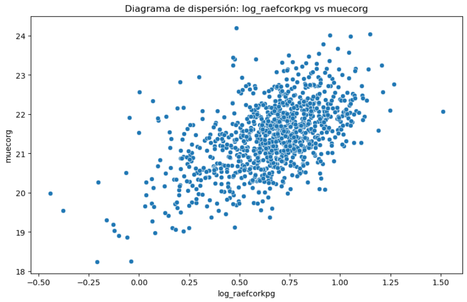
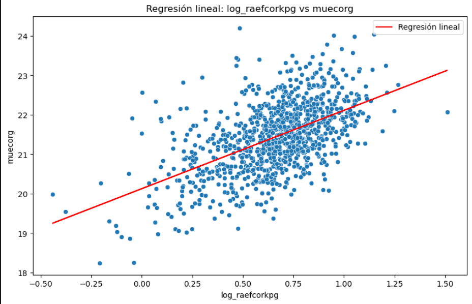

# Análisis de Resultados del proyecto de regresión lineal de galaxias 

## Alumno: Daniel Alejandro Hernández Gálvez
## Materia: Programacion I
## Profesor: Jose Manuel Nava Cervantes

## 1. Carga y Exploración Inicial de Datos

- **Fuente**: Datos cargados desde galaxias_data.xlsx (el archivo fue cargado a google sheets para facilitar el consumo de la información)

### Variables Clave

- **raefcorkpg**: valores entre 1.8 y 7.8  
- **muecorg**: valores entre 20.96 y 22.48

---

## 2. Transformación de Datos

Se aplicó una transformación logarítmica a la variable `raefcorkpg`:

```python
df['log_raefcorkpg'] = np.log10(df['raefcorkpg'])
```

**Ejemplo**:  
Si `raefcorkpg = 1.798885` → entonces `log_raefcorkpg = 0.255003`

---

## 3. Estadísticas Descriptivas

### Para `log_raefcorkpg`:

| Métrica                | Valor   |
|------------------------|---------|
| Media                  | 0.659   |
| Mediana                | 0.687   |
| Moda                   | -0.440  |
| Varianza               | 0.060   |
| Desviación Estándar    | 0.245   |

### Para `muecorg`:

| Métrica                | Valor   |
|------------------------|---------|
| Media                  | 21.433  |
| Mediana                | 21.466  |
| Moda                   | 18.246  |
| Varianza               | 0.788   |
| Desviación Estándar    | 0.888   |

---

## 4. Visualización y Regresión Lineal

### Gráficos de dispersión:

  


**Observación**: Existe una **relación positiva** entre `log_raefcorkpg` y `muecorg`.

### Modelo de regresión lineal:

```
y = 1.9848 * x + 20.1258
```

**Interpretación**:  
Por cada aumento de 1 unidad en `log_raefcorkpg`, el valor de `muecorg` aumenta aproximadamente **1.98 unidades**.

---

## 5. Prompts para Reproducir el Análisis

- "Explica cómo se cargan los datos desde Google Sheets y qué variables contiene el dataset."
- "¿Qué transformación se debe aplicar a la columna 'raefcorkpg' y por qué?"
- "Muestra las medidas de tendencia central para las variables `log_raefcorkpg` y `muecorg`."
- "Interpreta los coeficientes de la regresión lineal obtenida."
- "¿Cómo se distribuyen los valores de `muecorg` según las estadísticas descriptivas?"
- "Compara la media y la mediana de `log_raefcorkpg`: ¿qué indica sobre su distribución?"
